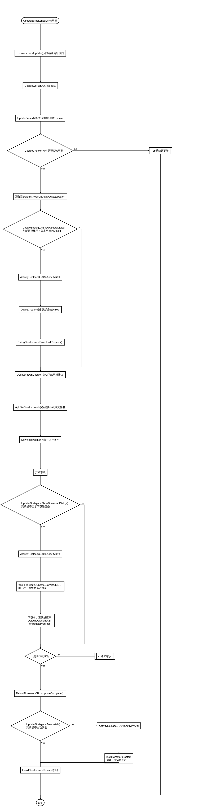

# UpdatePlugin    [  ](https://bintray.com/yjfnypeu/maven/UpdatePlugin/_latestVersion)   <a href="http://www.methodscount.com/?lib=org.lzh.nonview.updateplugin%3AUpdatePlugin%3A0.7.1"></a>


可任意定制的app更新组件。

### 引入方式：
加入jcenter依赖。
```
allprojects {
    repositories {
        jcenter()
    }
}
```
- 在要使用的项目的build.gradle中。添加依赖：

LastestVersion= [  ](https://bintray.com/yjfnypeu/maven/UpdatePlugin/_latestVersion)

```
dependencies {
    ...
    compile "org.lzh.nonview.updateplugin:UpdatePlugin:2.1"
}
```

### 效果展示

- 使用默认更新：


### 使用方式：

[查看wiki](https://github.com/yjfnypeu/UpdatePlugin/wiki)

### 流程图


流程图中的UpdateWorker/UpdateParser/UpdateChecker等均为框架提供的对外接口,如需要对框架根据自己的业务需要进行定制,均可实现这些接口并设置到UpdateConfig或者UpdateBuilder中进行定制使用,

###联系作者
email: 470368500@qq.com
QQ群: 108895031