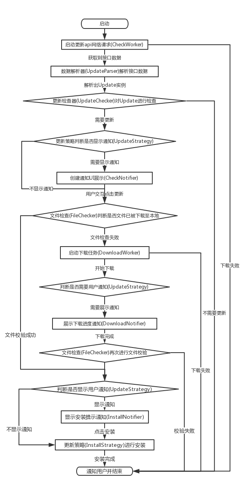

# UpdatePlugin [](https://jitpack.io/#yjfnypeu/UpdatePlugin)


UpdatePlugin是一款用来进行app更新升级的框架。

### 原理
UpdatePlugin主要基于对整个更新流程的梳理，针对更新流程中可能的被用户需要定制的节点。提供对应的定制接口出来提供用户进行各种定制；

为了方便用户直接使用，对于更新流程中非用户必须定制的接口。框架也对各个节点实现了一套自身默认的定制接口。做到拿来即用的。

### 特性

- 支持断点下载
- 支持 [Android 8.0] 应用安装方式
- 支持接入任意更新api
- 支持强制更新、忽略此版本更新逻辑
- 支持对apk进行安全检查，防止类似DNS劫持后被替换更新apk包的情况
- 支持指定apk下载文件地址
- 支持定制接入更新网络任务。适配更多网络使用场景
- 支持定制各种更新策略。比如默认使用的WIFI下默认直接下载后再通知更新，非WIFI下先通知更新再启动下载等。
- 支持定制安装策略。比如在插件化、热修复环境下进行定制使用
- 支持任意定制更新流程中的各种通知：检查到有更新时的通知、下载时的进度条通知、下载完成后安装之前的通知。
- 支持定制后台任务重启逻辑

### 引入方式：

由于各种原因，现将依赖仓库地址，从jCenter迁移到JitPack，请升级新版使用时注意一下：

加入JitPack仓库依赖。
```
allprojects {
    repositories {
        maven { url 'https://jitpack.io' }
    }
}
```
- 在要使用的项目的build.gradle中。添加依赖：

LastestVersion= [](https://jitpack.io/#yjfnypeu/UpdatePlugin)

```
dependencies {
    ...
    compile "com.github.yjfnypeu:UpdatePlugin:$LastestVersion"
}
```

### 流程图



### 使用方式：

#### 创建更新配置类：

```
UpdateConfig.getConfig()
		.setUrl(url)// 配置检查更新的API接口
		.setUpdateParser(new UpdateParser() {
			@Override
			public void Update parse(String response) throws Exception {
				// TODO 此处的response数据为上方检查更新接口所返回回来的数据。
				// 需要在此对response数据进行解析，并创建出对应的update实体类数据
				// 提供给框架内部进行使用
				return update;
			}
		});
```

#### 启动更新任务

框架提供两种更新任务启动方式，分别对应于不同的场景下进行使用：

##### 1. 普通更新任务

```
UpdateBuilder.create()
	.check();// 启动更新任务
```
普通更新任务主要用于设置页中，由用户点击检查更新时所主动触发的更新任务。
##### 2. 后台更新任务

后台更新任务主要是提供出来，采用后台轮询更新的机制，便于及时检查到新发布的APK进行版本更新

```
UpdateBuilder task = UpdateBuilder.create()

// 启动后台更新任务，retryTime为重启时间间隔，单位为秒。
// 即通过此方法所启动的更新任务。将会在'无更新'，'更新失败'等条件下：
// 延迟指定的时间间隔后，自动重新启动。
task.checkForDaemon(retryTime);
...
// 可使用此方法，停止后台更新任务的重启机制。
task.stopDaemon();
```

[更多使用方法请参考此处WIKI文档](https://github.com/yjfnypeu/UpdatePlugin/wiki)

### 联系作者
email: 470368500@qq.com

<a target="_blank" href="http://shang.qq.com/wpa/qunwpa?idkey=99e758d20823a18049a06131b6d1b2722878720a437b4690e238bce43aceb5e1"></a>

或者手动加入QQ群: 108895031
