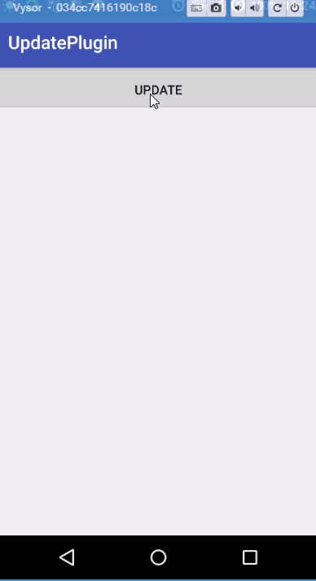
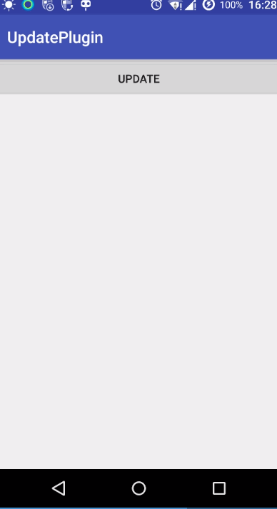

###UpdatePlugin详细配置说明

配置分为全局配置与局部配置:

- 全局配置在UpdateConfig类中。如上面的url,jsonParser就是全局配置的其中两个。
- 局部配置在UpdateBuilder类中。UpdateBuilder类中集成了UpdateConfig类中的全部配置。当使用UpdateBuilder进行check更新的时候。当没对此builder进行对应的配置设置的时候。会自动使用UpdateConfig中的配置

下面来看看除了以上所说的url与jsonParser外都支持哪些配置。

**ps:以下配置均为不必要配置。若不配置则使用框架内部默认配置**

- 配置检查更新时的回调。

```
checkCB(new UpdateCheckCB() {

    @Override
    public void onCheckStart() {
        // 此方法的回调所处线程异于其他回调。其他回调所处线程为UI线程。
        // 此方法所处线程为你启动更新任务是所在线程
    }

    @Override
    public void hasUpdate(Update update) {
        // 有新版本APK更新的回调
    }

    @Override
    public void noUpdate() {
        // 没有新版本的回调
    }

    @Override
    public void onCheckError(int i, String s) {
        // 更新检查错误的回调
    }
    
    @Override 
    public void onUserCancel() {
        // 用于取消更新时的回调
    }

    @Override
    public void onCheckIgnore(Update update) {
        // 用户点击忽略此版本更新时的回调
    }
})
```

- 新版本APK下载时的回调

```
downloadCB(new UpdateDownloadCB() {
    @Override
    public void onUpdateStart() {
        // 下载开始 
    }
    
    @Override
    public void onUpdateComplete(File file) {
        // 下载完成 
    }
    
    @Override
    public void onUpdateProgress(long current, long total) {
        // 下载进度 
    }
    
    @Override
    public void onUpdateError(int code, String errorMsg) {
        // 下载apk错误 
    }
})
```

- 自定义更新接口的访问任务，默认参考：[DefaultUpdateWorker.java](./updatepluginlib/src/main/java/org/lzh/framework/updatepluginlib/business/DefaultUpdateWorker.java)

```
checkWorker(new UpdateWorker() {

    @Override
    protected String check(String url) throws Exception {
        // 此处运行于子线程。在此进行更新接口访问 
        return null;
    }
})
```

- 自定义版本检查
```
.updateChecker(new UpdateChecker() {
        @Override
        public boolean check(Update update) {
            // 对于部分应用。是应用内定义字段来做版本对比检测的。可以定制UpdateCheker,
            // 并在此对应用版本进行比对检测。返回true说明该update版本需要被更新。false不需要更新
            return false;
        }
    })
```

- 自定义文件下载接口的访问任务。默认参考：[DefaultDownloadWorker](./updatepluginlib/src/main/java/org/lzh/framework/updatepluginlib/business/DefaultDownloadWorker.java)

```
downloadWorker(new DownloadWorker() {
    @Override
    protected void download(String url, File file) throws Exception {
        // TODO: 2016/5/11 此处运行于子线程，在此进行文件下载任务。
        // 对于自定义的下载任务。在下载期间需要调用此类的sendUpdateProgress进行下载进度传递
    }
})
```

- 自定义下载文件缓存,默认参考：[DefaultFileCreator](./updatepluginlib/src/main/java/org/lzh/framework/updatepluginlib/creator/DefaultFileCreator.java)

```
.fileCreator(new ApkFileCreator() {
    @Override
    public File create(String versionName) {
        // versionName 为解析的Update实例中的update_url数据。在这里可自定义下载文件缓存路径及文件名。放置于File中
        return null;
    }
})
```

- 自定义更新策略，默认WIFI下自动下载更新，参考：[WifiFirstStrategy](./updatepluginlib/src/main/java/org/lzh/framework/updatepluginlib/strategy/WifiFirstStrategy.java)

```
strategy(new UpdateStrategy() {
    @Override
    public boolean isShowUpdateDialog(Update update) {
        // 是否在检查到有新版本更新时展示Dialog。
        return false;
    }

    @Override
    public boolean isAutoInstall() {
        // 下载完成后，是否自动更新。若为false。则创建Dialog显示
        return false;
    }

    @Override
    public boolean isShowDownloadDialog() {
        // 在APK下载时。是否显示下载进度的Dialog
        return false;
    }
})
```

- 自定义检查出更新后显示的Dialog，默认参考：[DefaultNeedUpdateCreator](./updatepluginlib/src/main/java/org/lzh/framework/updatepluginlib/creator/DefaultNeedUpdateCreator.java)

```
updateDialogCreator(new DialogCreator() {
    @Override
    public Dialog create(Update update, Activity activity, UpdateBuilder updateBuilder) {
        // 此处为检查出有新版本需要更新时的回调。运行于主线程，在此进行更新Dialog的创建 
        // 对于用户自定义的Dialog。用户可自行在此更新update中的数据对Dialog进行展示。
        // 在用户需要立即更新时。调用此类中的sendDownloadRequest(update,activity);
        // 在用户需要取消更新时。调用此类中的sendUserCancel();
        // 在用户需要忽略此版本更新时。调用此类中的sendCheckIgnore(update);
        return dialog;
    }
})
```

- 自定义下载时的进度条Dialog,默认参考：[DefaultNeedDownloadCreator](./updatepluginlib/src/main/java/org/lzh/framework/updatepluginlib/creator/DefaultNeedDownloadCreator.java)

```
.downloadDialogCreator(new DownloadCreator() {
    @Override
    public UpdateDownloadCB create(Update update, Activity activity) {
        // 此处为正在下载APK时的回调。运行于主线程。在此进行Dialog自定义与显示操作。
        // 需要在此创建并返回一个UpdateDownloadCB回调。用于对Dialog进行更新。
        return cb;
    }
})
```

- 自定义下载完成后。显示的Dialog,默认参考[DefaultNeedInstallCreator](./updatepluginlib/src/main/java/org/lzh/framework/updatepluginlib/creator/DefaultNeedInstallCreator.java)

```
installDialogCreator(new InstallCreator() {
    @Override
    public Dialog create(Update update, String s, Activity activity) {
        // 此处为下载APK完成后的回调。运行于主线程。在此创建Dialog
        // 在用户需要立即更新时。调用此类中的sentToInstall();
        // 在用户需要取消更新时。调用此类中的sendUserCancel();
        // 在用户需要忽略此版本更新时。调用此类中的sendCheckIgnore(update);
        return dialog;
    }
})
```

最后举个例子来对更新策略做个说明：

```
public class MyApplication extends Application {
    private String apkFile = "http://apk.hiapk.com/web/api.do?qt=8051&id=721";

    @Override
    public void onCreate() {
        super.onCreate();
        // Application中对Config进行配置
        UpdateConfig.getConfig()
                .url("http://www.baidu.com")// 随便模拟的一个网络接口。
                .jsonParser(new UpdateParser() {
                    @Override
                    public Update parse(String response) {
                        // 此处模拟一个Update对象，传入接口返回的原始数据进去保存。
                        // 若用户需要自定义的时候。对于有额外参数。可从中获取并定制。
                        Update update = new Update(response);
                        // 此apk包的更新时间
                        update.setUpdateTime(System.currentTimeMillis());
                        // 此apk包的下载地址
                        update.setUpdateUrl(apkFile);
                        // 此apk包的版本号
                        update.setVersionCode(2);
                        // 此apk包的版本名称
                        update.setVersionName("2.0");
                        // 此apk包的更新内容
                        update.setUpdateContent("测试更新");
                        // 此apk包是否为强制更新
                        update.setForced(true);
                        // 是否显示忽略此次版本更新
                        update.setIgnore(false);
                        return update;
                    }
                })
                // 此参数可不配置。配置在此作为全局的更新接口回调通知
                .checkCB(new EmptyCheckCB() {

                    @Override
                    public void onCheckError(int code, String errorMsg) {
                        Toast.makeText(MyApplication.this, "更新失败：code:" + code + ",errorMsg:" + errorMsg, Toast.LENGTH_SHORT).show();
                    }

                    @Override
                    public void onUserCancel() {
                        Toast.makeText(MyApplication.this, "用户取消更新", Toast.LENGTH_SHORT).show();
                    }

                    @Override
                    public void noUpdate() {
                        Toast.makeText(MyApplication.this, "无更新", Toast.LENGTH_SHORT).show();
                    }
                })
    }
}
```

接下来在需要进行更新的Activity中进行更新检查

```
UpdateBuilder.create().check(MainActivity.this);
```

此处使用默认的更新策略：WIFI下自动更新。流量环境下提示再下载提示更新：



再使用自定义策略：

```
UpdateBuilder.create()
    .strategy(new UpdateStrategy() {
        @Override
        public boolean isShowUpdateDialog(Update update) {
            // 有新更新直接展示
            return true;
        }

        @Override
        public boolean isAutoInstall() {
            return false;
        }

        @Override
        public boolean isShowDownloadDialog() {
            // 展示下载进度
            return true;
        }
    })
    .check(MainActivity.this);
```



再来一个。直接下载完成后。自动弹出安装页面

```
UpdateBuilder.create()
    .strategy(new UpdateStrategy() {
        @Override
        public boolean isShowUpdateDialog(Update update) {
            return false;
        }

        @Override
        public boolean isAutoInstall() {
            return true;
        }

        @Override
        public boolean isShowDownloadDialog() {
            return false;
        }
    })
    .check(MainActivity.this);
```

